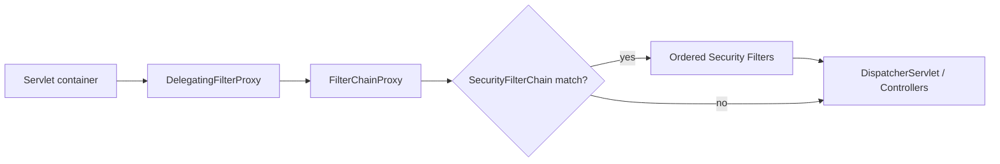

# Detailed Presentation: How Spring Security Works

> Audience: intermediate Java/Spring developers who want to understand Spring Security internals, not just copy-paste configuration.
>
> Focus: modern stack assumptions (Spring Security 7 style APIs, lambda DSL, `SecurityFilterChain`-based config).

## Executive summary

Spring Security is a framework for authentication, authorization, and exploit protection in Spring applications. In the servlet stack, each HTTP request passes through an ordered security filter pipeline (`SecurityFilterChain`) orchestrated by `FilterChainProxy`.

At a high level:
- **Authentication** answers: who are you?
- **Authorization** answers: what are you allowed to do?
- **Protection mechanisms** (CSRF, CORS integration, session policies, headers) reduce common attack surface.

---

## Learning goals

After this presentation, participants should be able to:
- Explain how requests traverse `FilterChainProxy` and one or more `SecurityFilterChain`s.
- Distinguish `SecurityContextHolder`, `SecurityContext`, `Authentication`, and `GrantedAuthority`.
- Describe `AuthenticationManager` / `ProviderManager` / `AuthenticationProvider` collaboration.
- Configure request-level and method-level authorization.
- Choose sane defaults for CSRF/CORS/session management.
- Test security rules with `spring-security-test` and MockMvc.

---

## 1) Request lifecycle in servlet security

Conceptual pipeline:



Key ideas:
- `FilterChainProxy` is the main entry point to Spring Security filters.
- Multiple `SecurityFilterChain` beans can coexist (different request matchers).
- Authentication should be established before authorization decisions.

---

## 2) Core model objects

### `SecurityContextHolder`
Holds the current `SecurityContext` (usually in `ThreadLocal` for servlet requests).

### `SecurityContext`
Container for current `Authentication`.

### `Authentication`
Represents either:
- an unauthenticated authentication request token (input), or
- an authenticated principal with authorities (output).

### `GrantedAuthority`
Atomic authority strings used by authorization logic (`ROLE_ADMIN`, `DATA_READ`, `SCOPE_orders.read`, etc.).

---

## 3) Authentication architecture

### `AuthenticationManager`
Main contract: `authenticate(authentication)`.

### `ProviderManager`
Most common implementation. Iterates over configured `AuthenticationProvider`s.

### `AuthenticationProvider`
Custom/auth mechanism-specific logic:
- `supports(Class<?>)` says if provider can handle token type.
- `authenticate(Authentication)` returns authenticated token or throws `AuthenticationException`.

### `UserDetailsService` + `PasswordEncoder`
For username/password flows:
- `UserDetailsService#loadUserByUsername` fetches user data.
- `PasswordEncoder` verifies one-way password hashes.
- `DelegatingPasswordEncoder` enables algorithm migration.

---

## 4) Authorization architecture

### Request-level authorization
Use `authorizeHttpRequests` in `HttpSecurity` for URL/method rules.

### Method-level authorization
Enable with `@EnableMethodSecurity` and annotate service methods (`@PreAuthorize`, etc.).

### Roles vs authorities
- `hasRole("ADMIN")` typically maps to `ROLE_ADMIN`.
- `hasAuthority("DATA_UPDATE")` is explicit and often better for fine-grained API permissions.

---

## 5) Modern `HttpSecurity` mental model

`HttpSecurity` composes security behavior by enabling/configuring building blocks:
- authentication mechanism(s): `httpBasic`, `formLogin`, `oauth2Login`, `oauth2ResourceServer`
- authorization rules
- exception handling (`AuthenticationEntryPoint`, `AccessDeniedHandler`)
- session policy
- CSRF/CORS and other exploit protections

Minimal modern baseline:

```java
@Configuration
@EnableWebSecurity
class SecurityConfig {

  @Bean
  SecurityFilterChain securityFilterChain(HttpSecurity http) throws Exception {
    http
      .authorizeHttpRequests(auth -> auth
        .requestMatchers("/public/**", "/actuator/health").permitAll()
        .anyRequest().authenticated()
      )
      .httpBasic(Customizer.withDefaults());

    return http.build();
  }
}
```

---

## 6) Authentication flows to explain in class

### A) Form Login
- Unauthorized protected request -> redirect to login page.
- `UsernamePasswordAuthenticationFilter` creates auth token.
- `AuthenticationManager` authenticates via provider(s).
- On success, authenticated principal is stored in context/session.

### B) HTTP Basic
- Unauthenticated request -> `401` + `WWW-Authenticate` challenge.
- Client retries with `Authorization: Basic ...`.

### C) JWT Bearer (Resource Server)
- `BearerTokenAuthenticationFilter` extracts token.
- `JwtAuthenticationProvider` validates/decodes JWT.
- Claims map to authorities (often `SCOPE_*` for OAuth2 scopes).

### D) OAuth2/OIDC Login
- Browser redirect flow (Authorization Code).
- App exchanges code for tokens.
- End-user identity becomes authenticated principal in app session.

---

## 7) CSRF, CORS, and session management

### CSRF
- Relevant for browser-based, cookie-backed authenticated flows.
- Enabled by default for unsafe methods in typical servlet setups.
- Keep enabled for stateful web apps unless you have a clear reason.

### CORS
- Preflight requests are usually unauthenticated and must be handled correctly.
- Configure CORS so it is processed consistently with security.

### Session management
- Stateful default: context persisted via HTTP session.
- Stateless API style: `SessionCreationPolicy.STATELESS`.
- Understand implications of explicit context save behavior in modern versions.

---

## 8) Practical configuration templates

### Stateful web app (form login)

```java
@Bean
SecurityFilterChain web(HttpSecurity http) throws Exception {
  http
    .authorizeHttpRequests(auth -> auth
      .requestMatchers("/public/**", "/login", "/error").permitAll()
      .anyRequest().authenticated()
    )
    .formLogin(Customizer.withDefaults())
    .csrf(Customizer.withDefaults());

  return http.build();
}
```

### Stateless REST API (JWT Resource Server)

```java
@Bean
SecurityFilterChain api(HttpSecurity http) throws Exception {
  http
    .authorizeHttpRequests(auth -> auth
      .requestMatchers("/actuator/health").permitAll()
      .requestMatchers("/api/admin/**").hasAuthority("SCOPE_admin")
      .anyRequest().authenticated()
    )
    .oauth2ResourceServer(oauth2 -> oauth2.jwt(Customizer.withDefaults()))
    .sessionManagement(sm -> sm.sessionCreationPolicy(SessionCreationPolicy.STATELESS))
    .csrf(csrf -> csrf.disable());

  return http.build();
}
```

```yaml
spring:
  security:
    oauth2:
      resourceserver:
        jwt:
          issuer-uri: https://idp.example.com/issuer
```

---

## 9) Best practices and common pitfalls

- Prefer layered authorization: endpoint + method security.
- Keep password handling modern (`DelegatingPasswordEncoder`, strong encoders).
- Avoid custom JWT filters when standard Resource Server support is sufficient.
- Treat bearer tokens as secrets: TLS everywhere, short TTL, key rotation strategy.
- Watch for CORS preflight failures and context persistence surprises during upgrades.

---

## 10) Testing strategy

Recommended layers:
- Unit tests for custom providers/converters/verifiers.
- Integration tests with real filter chain (`MockMvc` + `springSecurity()`).
- Method security tests with `@WithMockUser` / custom security context.
- Explicit CSRF tests for unsafe methods.

MockMvc setup:

```java
mockMvc = MockMvcBuilders
    .webAppContextSetup(context)
    .apply(SecurityMockMvcConfigurers.springSecurity())
    .build();
```

---

## 11) Migration checklist (6.x -> 7 style)

- Use component-based config (`SecurityFilterChain` beans).
- Use lambda DSL style consistently.
- Prefer `authorizeHttpRequests` over legacy alternatives.
- Re-validate session/context persistence assumptions in custom auth flows.
- Re-test exception mapping (`401` vs `403`) and CORS/CSRF behavior.

---

## 12) Suggested talk timing (55–75 minutes)

- Fundamentals and architecture: 15–20 min
- Authentication/authorization internals: 15–20 min
- Flows (form/basic/jwt/oauth2login): 15–20 min
- Pitfalls, testing, migration, Q&A: 10–15 min

---

## Final takeaways

1. Think in terms of **filter pipeline + security model objects**.
2. Separate authentication mechanism choices from authorization policy decisions.
3. Prefer standard, well-supported integrations (especially for JWT/OAuth2).
4. Treat CSRF/CORS/session behavior as first-class security design concerns.
5. Test security rules as rigorously as business logic.
